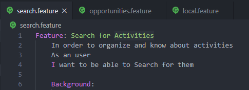
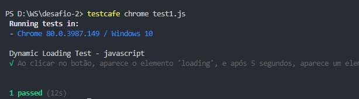
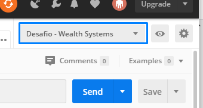
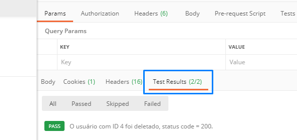
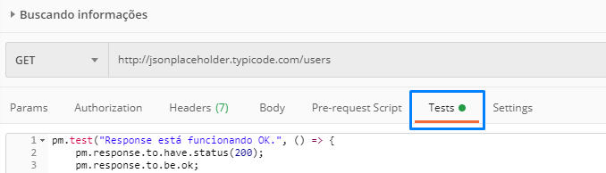

# desafio-qa-wealth-sys 🚀
Meu projeto para o desafio proposto pela Wealth Systems para a vaga de Analista de QA.

## Desafio 1 - Cenários de testes.

A resolução deste desafio foi desenvolvida no Visual Studio Code, com os cenários de testes escritos em Gherkin, **em inglês** (para aproveitar melhor o highlighting do código e sintáxe), analisando o protótipo fornecido, descrevendo 3 features, com 2 cenários em cada uma delas, totalizando 6 cenários de testes para a imagem.

> Se necessário a versão em português dos cenários, poderei fornecer, reescrevendo e atualizando o repositório.

Para poder visualiza-los, poderá acessar a pasta "desafio-1" deste repositório e abrir os arquivos diretamente no Github, ou realizar o download da pasta e abrir com um editor de texto de sua preferência.

---

## Desafio 2 - Automação de 2 funcionalidades front-end.

A resolução deste desafio foi desenvolvida com o [TestCafé ☕️](https://devexpress.github.io/testcafe/), um framework em Node.js e Javascript de testes end-to-end automatizados para a Web, onde foi criado testes especificos para os links fornecidos pelo próprio desafio ([link1](https://the-internet.herokuapp.com/dynamic_loading/1) e [link2](https://the-internet.herokuapp.com/challenging_dom)).

#### Para validar os testes e conferir o código, siga os passos:

1.  Primeiro será necessário ter o TestCafé configurado na máquina, e consequentemente, o [Node.js](https://nodejs.org/en/download/).

    Para instalar o TestCafé, execute o seguinte comando: 
        
        npm install -g testcafe
    
2.  Faça o download dos arquivos test1.js e test2.js que se encontram na pasta "desafio-2" deste repositório. Cada um destes testes são referentes aos links propostos.

3.  Abra o seu editor de texto preferido e/ou o prompt de comando do seu computador ou do editor na pasta onde foi salvo os dois arquivos anteriores e execute os seguintes códigos:
    
        testcafe chrome test1.js
        
        testcafe chrome test2.js
        
Ele deverá abrir uma instancia do navegador Chrome (pode trocar para outros navegadores, se desejar) onde irá rodar um servidor local, com o link inserido pelo teste, e os resultados serão exibidos no prompt de comando/terminal que está usando, conforme imagem abaixo:

O mesmo poderá ser observado para o test2.js;

---

## Desafio 3 - Automação de 1 funcionalidade back-end.

Este desafio foi resolvido com a construção da resolução na plataforma Postman, utilizando a [API fornecida](http://jsonplaceholder.typicode.com/users/ "JSONPlaceHolder") e os requests GET, POST, PUT e DELETE, validando as responses com os tests preparados dentro do programa.

#### Para analisar o código dos testes e o resultado deles, siga os passos:

1.  Primeiro, será necessário importar a Collection, com o enviroment onde contém as váriaveis usadas para melhor entendimento e padronização do código, usando o botão:

    
    
    Quando acessado, ele deverá abrir o aplicativo do Postman, já importando o código necessário.

    ##### Lembrando que será necessário habilitar o enviroment "Desafio - Wealth Systems" para que as váriaveis utilizadas no projeto possam funcionar:

    
    
2.  Com o aplicativo do Postman aberto, deverá então dar "Send" nas 4 requisições criadas à API. *Ou clicar no botão "Runner" na parte superior*. Logo abaixo, verá uma guia "Tests Results", onde irá conter os logs dos tests criados.

    

    Para ver os códigos gerados pelos tests, vá até a guia "Tests".

    

---

### E é isto... 🗯

Espero que compreendam a forma como lidei com os determinados desafios, e novamente, agradeço a oportunidade de ao menos chegar até esta fase!
